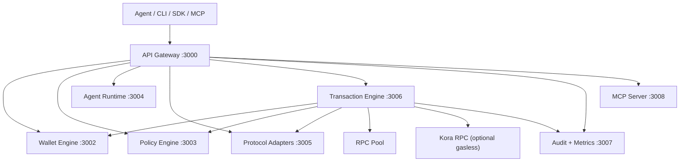
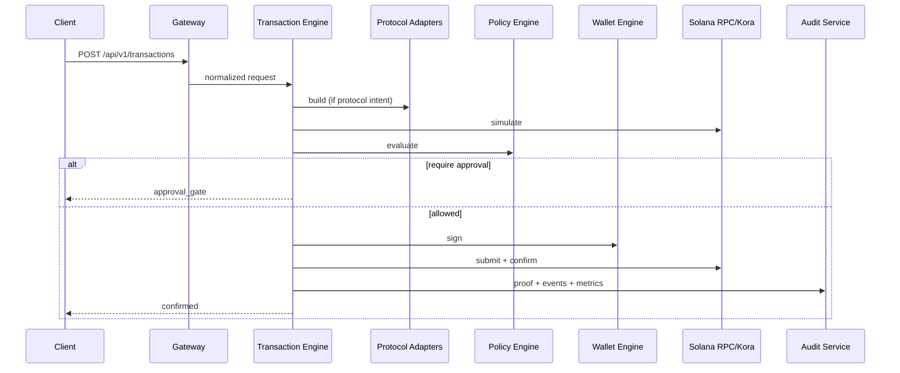

# Architecture Reference

This document is the technical architecture reference for Agentic Wallet.

It focuses on implementation details that matter for correctness, reliability,
and safe extension.

## 1. System Overview

Agentic Wallet is a multi-service Solana execution platform where agents emit
structured intents and a controlled pipeline handles:

- schema validation
- protocol build
- simulation
- risk and policy evaluation
- approval gating
- signing
- submission/confirmation
- proofing/audit/metrics

Core invariant:

- agents never receive private keys
- wallet-engine is the only signing boundary

## 2. Service Graph

## 3. Trust Boundaries

### 3.1 Agent Boundary

Agents are untrusted intent producers.
They can request actions but cannot sign directly.

### 3.2 Gateway Boundary

API Gateway enforces auth/scope/rate-limit and normalizes machine responses
(`status`, `errorCode`, `failedAt`, `stage`, `traceId`).

### 3.3 Policy/Risk Boundary

Transaction execution can proceed only if protocol-risk and policy-engine
evaluation permit it.

### 3.4 Signing Boundary

Wallet-engine holds custody and signing logic. No other service should own
private key material.

### 3.5 Protocol Boundary

Protocol-specific transaction construction is isolated in protocol-adapters.

## 4. Responsibilities by Service

### 4.1 API Gateway (`apps/api-gateway`)

- request authentication and scope authorization
- tenant checks (when configured)
- in-memory rate limiting per API key
- proxy routing to backend services
- normalized machine error and stage mapping

### 4.2 Wallet Engine (`services/wallet-engine`)

- wallet creation
- wallet metadata retrieval/listing
- SOL/SPL balance views
- transaction/message signing
- signer backend abstraction (encrypted-file, memory, kms, hsm, mpc)

### 4.3 Policy Engine (`services/policy-engine`)

- policy CRUD/versioning
- compatibility check/migration endpoints
- policy evaluation endpoint
- rule modules (spending, rate, allow/block, slippage, protocol/portfolio risk)

### 4.4 Agent Runtime (`services/agent-runtime`)

- agent lifecycle (create/start/stop/pause/resume)
- capability allowlist enforcement (intent/protocol)
- optional manifest enforcement
- budget checks
- strategy backtest and paper execution
- treasury allocation and rebalance
- per-agent execution endpoint

### 4.5 Protocol Adapters (`services/protocol-adapters`)

- adapter registry and capability discovery
- protocol health probes
- build/quote routes
- adapter compatibility checks
- intent migration route
- protocol-specific builders for system/spl/jupiter/marinade/solend/metaplex/orca/raydium/escrow

### 4.6 Transaction Engine (`services/transaction-engine`)

- canonical transaction state machine
- transaction build/simulate/policy/sign/submit/confirm path
- read-only intent fast path
- proof generation and replay endpoints
- pending approval queue
- outbox worker with leasing/retry/dedupe
- protocol + portfolio risk stores
- delta guard and auto-pause integration
- rpc failover and adaptive fee/compute tuning

### 4.7 Audit Observability (`services/audit-observability`)

- audit event append/list
- metrics increment/get

### 4.8 MCP Server (`services/mcp-server`)

- named tools for common capabilities
- validated generic gateway proxy tool (`gateway.request`)

## 5. Canonical Transaction Lifecycle

Spend-capable intents:

1. `pending`
2. `simulating`
3. `policy_eval`
4. `approval_gate` (if required)
5. `signing`
6. `submitting`
7. `confirmed` or `failed`

Read-only intents (`query_balance`, `query_positions`) bypass spend stages and
return `confirmed` with data payload.

### 5.1 Sequence (Spend-Capable)

## 6. Build Path Resolution

Transaction-engine resolves build source in this order:

1. provided transaction payload
2. provided instructions payload
3. native transfer builders (`transfer_sol`, `transfer_spl`)
4. protocol-adapter `/api/v1/build`

Important behaviors:

- unfunded SOL destination accounts are rent-checked
- SPL destination ATA can be created idempotently
- unsupported protocol/type combinations fail closed

## 7. Policy and Risk Composition

Two layers are applied before signing:

1. Protocol and portfolio risk (transaction-engine internal)
2. Policy-engine decision (`allow | deny | require_approval`)

Risk controls include slippage, pool/program allowlists, quote staleness,
portfolio drawdown/loss/exposure limits, and gasless eligibility.

## 8. Approval Gate Model

If approval is required:

- transaction is parked in `approval_gate`
- pending approval entry includes expiry timestamp
- operator can approve or reject through dedicated endpoints
- approve path still uses wallet-engine signing and normal proofing

## 9. Reliability and Durability

### 9.1 RPC Failover

- pool URL list from `SOLANA_RPC_POOL_URLS`
- health-scored endpoint ordering
- periodic probing
- retry wrappers with bounded attempts/backoff

### 9.2 Adaptive Fee/Compute

Legacy transaction path can inject compute budget instructions based on:

- transaction type baseline
- instruction count
- recent priority fees
- configured percentile/multiplier/caps

### 9.3 Durable Outbox

Outbox actions are persisted with lease/retry semantics:

- actions: `execute | retry | approve`
- statuses: `pending | processing | done | failed`
- dedupe for open jobs by `(tx_id, action)`
- restart recovery via polling/drain

## 10. Persistence Topology

Current persistence is SQLite-first, with snapshots and compatible local state.

Primary persisted domains:

- wallet metadata and signer backend config
- transaction records and proofs
- outbox jobs
- policy versions/rules
- agent config/capabilities/budgets
- audit events and metrics

Design reality:

- strong local durability
- not a distributed consensus queue/state model yet

## 11. Protocol Adapter Model

Each adapter declares:

- `name`, `version`
- `capabilities`
- program ids
- build methods (`buildSwap`, `buildStake`, `buildSupply`, `buildIntent`, etc.)

Registry responsibilities:

- list capabilities
- health checks
- compatibility checks
- migration execution

## 12. Escrow Architecture

Escrow integration uses a real Anchor-backed program and supports create/accept/
release/refund/dispute/resolve plus milestone and x402 variants.

Adapter behavior:

- requires `ESCROW_PROGRAM_ID`
- validates intent shapes and public keys
- derives escrow PDA and method data
- provides devnet compatibility fallback where escrow rent economics would make
  the exact flow non-viable for low-balance demo wallets

## 13. Gasless Architecture (Kora)

If `gasless=true`:

- same validation/simulation/risk/policy checks still run first
- submission path uses Kora RPC integration
- gasless eligibility remains protocol-risk controlled

## 14. Error Contract Normalization

Gateway emits stable machine fields for all proxied errors:

- `status`
- `errorCode`
- `failedAt`
- `stage`
- `traceId`

Standard codes:

- `VALIDATION_ERROR`
- `POLICY_VIOLATION`
- `PIPELINE_ERROR`
- `CONFIRMATION_FAILED`

## 15. Extension Playbooks

### 15.1 Add New Intent Type

1. add shared schema/type in `packages/common`
2. add transaction-engine handling (build and expected delta behavior)
3. add policy and risk implications
4. add CLI/MCP affordances
5. add docs and tests

### 15.2 Add New Protocol Adapter

1. implement adapter in `services/protocol-adapters/src/adapters`
2. register adapter in registry
3. add capability and health routes
4. add risk defaults and allowlist expectations
5. add manual/devnet tests and docs

### 15.3 Add New Signer Backend

1. implement provider under wallet-engine signer abstraction
2. wire env requirements and validation
3. add signing tests for legacy/v0 tx and message mode
4. document custody and operational runbook changes

## 16. Deployment Shapes

### 16.1 Local Dev

- all services on localhost ports
- single node, file/sqlite-backed state
- devnet cluster default

### 16.2 Single-Region Production-Like

- gateway behind TLS and ingress controls
- services on private network
- persistent volumes/db snapshots
- external signer backends strongly recommended

### 16.3 Multi-Node Future Target

- shared durable queue and state store
- distributed rate-limit storage
- stronger consensus semantics for exactly-once claims across replicas

## 17. Architecture Risks and Tradeoffs

Accepted current tradeoffs:

- single-node durability focus before distributed consensus
- upstream protocol API dependency for certain builders/quotes
- local custody backend as default for developer speed

Planned hardening direction:

- distributed durability model
- richer approval governance (two-person/multisig)
- stronger infra identity and transport controls

## 18. Cross-Links

- Deep design rationale: `docs/DEEP_DIVE.md`
- Security controls/threat model: `docs/SECURITY.md`
- Endpoint contracts: `docs/API_REFERENCE.md`
- Ops procedures: `docs/OPERATIONS_RUNBOOK.md`
- Intent/protocol details: `docs/PROTOCOLS_AND_INTENTS.md`
- Testing workflow: `docs/TESTING_AND_VALIDATION.md`
