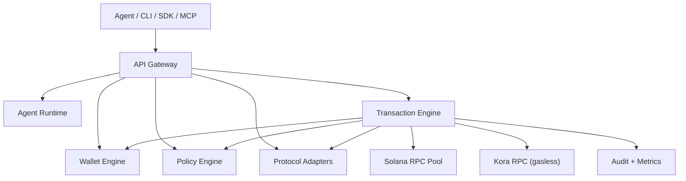

# Deep Dive: Agentic Wallet Design and Implementation

This document explains how the current implementation works under the hood, why key design choices were made, and where the remaining hardening work lives.

## 1) What This System Is

Agentic Wallet is a multi-service Solana execution system where:

- agents decide intents
- policy/risk engines gate execution
- protocol adapters build chain actions
- wallet-engine is the only signing boundary
- transaction-engine coordinates simulation, policy, submit, confirm, and proofs

Core property: agents do not hold signing keys and cannot bypass policy by design.

## 2) Architecture and Trust Boundaries

Boundary model:

- agent boundary: intent generation only
- gateway boundary: auth/scope/rate-limit and normalized machine response envelope
- policy boundary: allow/deny/require_approval before spend/sign
- signing boundary: only wallet-engine signs messages/transactions
- protocol boundary: all protocol-specific instruction creation lives in adapters

## 3) Service Responsibilities

- `apps/api-gateway`:
  - API key auth, tenant/scope checks, per-key rate limiting
  - normalized response fields (`status`, `errorCode`, `failedAt`, `stage`, `traceId`)
  - standardized error codes:
    - `VALIDATION_ERROR`
    - `POLICY_VIOLATION`
    - `PIPELINE_ERROR`
    - `CONFIRMATION_FAILED`
- `services/wallet-engine`:
  - creates wallets
  - stores wallet metadata
  - signs transaction/message payloads
  - exposes SOL/SPL balance views
- `services/policy-engine`:
  - stores versioned policies
  - evaluates rules into `allow | deny | require_approval`
  - supports compatibility/migration endpoints
- `services/protocol-adapters`:
  - registry of protocol builders
  - quote/build endpoints
  - adapter health probes
  - adapter compatibility and intent migration
- `services/transaction-engine`:
  - canonical execution state machine
  - simulation/policy/risk enforcement
  - approval queue
  - submission + confirmation
  - durable outbox orchestration
  - execution proofing and replay data
- `services/agent-runtime`:
  - agent lifecycle and scheduler
  - capability allowlists and manifest governance
  - budget checks, backtest gate, paper mode
  - treasury allocation/rebalance
- `services/audit-observability`:
  - immutable-ish event sink and metrics counters
- `services/mcp-server`:
  - named MCP tools + validated generic `gateway.request`

## 4) Transaction State Machine (Canonical Path)

Spend-capable intents progress through:

1. `pending`
2. `simulating`
3. `policy_eval`
4. `approval_gate` (when required)
5. `signing`
6. `submitting`
7. `confirmed` or `failed`

Read-only intents (`query_balance`, `query_positions`) are executed without spend pipeline stages and marked `confirmed` with result payloads.

### Pipeline behavior details

- simulation runs before signing
- policy-engine failures are fail-secure (`deny`)
- restricted/high-risk paths can be approval-gated
- approval pending entry has a 24h expiry (`Date.now() + 24*60*60*1000`)
- idempotency key replay returns existing transaction
- execution proof is produced for both successful and failed paths

## 5) Build Phase: How Transactions Are Constructed

`transaction-engine` builds unsigned payloads in this order:

1. caller-supplied transaction (if provided)
2. caller-supplied instructions (if provided)
3. native builders for:
   - `transfer_sol`
   - `transfer_spl`
4. protocol adapter build endpoint for all other intents

Notable guardrails:

- SOL transfer enforces rent-safety for unfunded destination accounts
- SPL transfer ensures destination ATA via idempotent ATA create instruction
- invalid/unknown protocol builds fail closed

## 6) Solana Reliability Layer

### RPC pool failover

The system can use multiple RPC endpoints via `SOLANA_RPC_POOL_URLS`.

- each endpoint has dynamic health score
- health score factors include failure streak and moving average latency
- proactive probes run on interval (`SOLANA_RPC_HEALTH_PROBE_MS`)
- requests run through sorted healthiest endpoints with failover

### Retry semantics

RPC operations are wrapped with bounded retry:

- max attempts: `SOLANA_RPC_MAX_RETRIES` (default 5)
- linear backoff base: `SOLANA_RPC_RETRY_DELAY_MS` (default 500ms)

### Adaptive fee + compute tuning

Before signing (legacy tx path), transaction-engine injects compute budget ixs:

- `ComputeBudgetProgram.setComputeUnitLimit`
- `ComputeBudgetProgram.setComputeUnitPrice`

Tuning inputs:

- intent-type baseline compute units
- instruction count buffer
- recent priority fees (`getRecentPrioritizationFees`)
- percentile and multiplier controls:
  - `SOLANA_PRIORITY_FEE_PERCENTILE`
  - `SOLANA_PRIORITY_FEE_MULTIPLIER_BPS`
  - min/max caps

## 7) Durable Execution Queue (Outbox)

Outbox is SQLite-backed (`outbox_jobs`) with WAL enabled and lease/retry semantics.

Key mechanics:

- actions: `execute | retry | approve`
- statuses: `pending | processing | done | failed`
- lease claim with expiry (`lease_id`, `lease_expires_at`)
- retry transitions with capped attempts (`TX_OUTBOX_MAX_ATTEMPTS`)
- dedupe unique index for open jobs by `(tx_id, action)`
- startup drain for recovery and periodic polling (`TX_OUTBOX_POLL_MS`)

Failure behavior:

- retryable vs non-retryable classification by error text
- failed outbox execution also marks tx `failed` with proof/audit context

Durability note:

- this is strong single-node durability and restart recovery
- it is not a distributed exactly-once queue across multiple writers/nodes

## 8) Policy and Risk Stack

There are two layers before signing:

### A) Protocol/portfolio risk in transaction-engine

- protocol risk config supports:
  - `maxSlippageBps`
  - `maxPoolConcentrationBps`
  - `allowedPools`
  - `allowedPrograms`
  - `oracleDeviationBps`
  - `requireOracleForSwap`
  - `maxQuoteAgeSeconds`
  - `deltaVarianceBpsThreshold`
  - `gaslessEligible`
- portfolio controls support:
  - `maxDrawdownLamports`
  - `maxDailyLossLamports`
  - `maxExposureBpsPerToken`
  - `maxExposureBpsPerProtocol`
  - `autoPauseOnBreach`

Risk outputs can force `deny` or `require_approval`.

### B) Policy-engine evaluation

Policy engine evaluates rule modules:

- `spending_limit`
- `address_allowlist`
- `address_blocklist`
- `program_allowlist`
- `token_allowlist`
- `protocol_allowlist`
- `rate_limit`
- `time_window`
- `max_slippage`
- `protocol_risk`
- `portfolio_risk`

Decision model:

- `allow`
- `deny`
- `require_approval`

Risk tier logic:

- restricted types (`flash_loan_bundle`, `cpi_call`, `custom_instruction_bundle`) are treated as critical and require approval by default

## 9) Approval Gate

When approval is required:

- tx status moves to `approval_gate`
- pending approval entry stored with expiry
- operator can:
  - approve: `/api/v1/transactions/:txId/approve`
  - reject: `/api/v1/transactions/:txId/reject`

Approval execution still preserves pipeline controls:

- signs only through wallet-engine
- submits/confirms through transaction-engine
- records execution proof and stage history

## 10) Signing and Custody Boundary

Wallet-engine custody design:

- keypairs generated in wallet-engine
- metadata stored in SQLite
- key material stored via provider abstraction
- default provider uses encrypted file storage with:
  - AES-256-GCM
  - scrypt-derived key
  - per-record salt and IV

Signer backends:

- `encrypted-file`
- `memory`
- `kms` (envelope-style key wrapping with backend-specific master secret/key-id)
- `hsm` (slot + pin + module-secret backed custody boundary)
- `mpc` (2-of-3 share reconstruction with encrypted per-node shares)

Signing API supports:

- legacy and v0 transactions
- raw message signing

## 11) Agent Runtime and Governance

Agent runtime exposes:

- agent lifecycle:
  - create, start, stop, pause, resume
- intent allowlist checks
- optional capability manifest enforcement
- budget gating for spend-capable intents
- optional backtest-pass gate before live spending
- paper-only execution mode
- built-in autonomous decision engine:
  - rule conditions (`tick`, `balance_lamports`, `known_wallets_count`)
  - strategy steps (round-robin sequenced intents)
  - cadence limits, per-rule/per-step cooldowns, max-actions-per-hour controls
  - templated intent fields (`{{tick}}`, `{{walletId}}`, `{{balanceLamports}}`, `{{knownWallet0}}`)

### Capability manifest model

Manifest includes:

- issuer/version/agentId
- allowed intents
- allowed protocols
- issuedAt/expiresAt/nonce
- HMAC signature

Enforcement path:

- verify signature
- verify expiry
- verify intent/protocol permission

## 12) Protocol Adapters

Current adapters:

- `system-program`
- `spl-token`
- `jupiter`
- `marinade`
- `solend`
- `metaplex`
- `orca`
- `raydium`
- `escrow`

Registry capabilities:

- protocol listing and version endpoint
- adapter health checks
- compatibility checks
- adapter-specific intent migration

Design choice:

- fail closed on build errors (no fake-success fallback)

## 13) Escrow: Real Program Integration

Escrow is backed by an Anchor program in `programs/escrow` and adapter version `3.0.0`.

Adapter requires `ESCROW_PROGRAM_ID` and emits instructions for:

- `create_escrow`
- `accept_escrow`
- `release_escrow`
- `refund_escrow`
- `dispute_escrow`
- `resolve_dispute`
- `create_milestone_escrow`
- `release_milestone`
- `x402_pay`

On-chain account model includes:

- creator/recipient/arbiter/fee_recipient
- escrow amount and status enum
- deadline, terms hash, dispute reason
- milestone/x402 flags

## 14) Gasless Mode (Kora)

If request sets `gasless: true`:

- normal build/simulate/policy/risk gates still run first
- submission switches to Kora `signAndSendTransaction`

Gasless eligibility is additionally constrained by per-protocol risk config (`gaslessEligible`).

## 15) Observability, Proof, and Replay

For each transaction, system emits:

- stage transition audit events
- policy/risk decisions
- metrics counters
- deterministic execution proof fields:
  - `intentHash`
  - `policyHash`
  - `simulationHash`
  - `proofHash`
  - signature (when present)

APIs:

- proof: `GET /api/v1/transactions/:txId/proof`
- replay: `GET /api/v1/transactions/:txId/replay`

## 16) Data and Persistence Layout

Persistence model is SQLite-first in current state:

- wallet metadata: `wallet-engine.sqlite` (`wallets` table)
- outbox queue: `state.sqlite` (`outbox_jobs` table)
- cross-service state snapshots: SQLite `snapshots` table keyed by logical store name
- key material: encrypted files under wallet-engine data directory

Legacy JSON migration exists for backwards compatibility.

## 17) Compatibility for External Agent Orchestrators

CLI compatibility entrypoints:

- `npm run intent-runner -- --file <intent.json>`
- `npm run intent-runner -- --intent '<json>'`
- `npm run wallets -- list`
- `npm run wallets -- create --label <name>`

Intent adapter behavior:

- supports legacy fields (`fromWalletId`, `chain`, `createdAt`, `reasoning`)
- maps legacy `transfer` into `transfer_sol` or `transfer_spl`
- maps legacy `swap`, `create_mint`, `mint_token`
- preserves legacy metadata in intent payload

Gateway machine envelope ensures stable fields for orchestration systems.

## 18) Design Tradeoffs

Why this shape works:

- strict service boundaries make key exfiltration and direct policy bypass harder
- outbox + stage history improve restart resilience and forensic visibility
- adapter registry keeps protocol growth decoupled from execution core
- deterministic proof hashes improve reproducibility and auditability

Tradeoffs accepted:

- primarily single-node operational model
- external API dependency for some protocol builders
- local encrypted-file custody is still the default, while `kms|hsm|mpc` are selectable runtime backends

## 19) Known Gaps and Next Hardening Priorities

1. distributed durability
- outbox and snapshot stores are durable locally, but not yet deployed as a multi-node consensus queue/state system.

2. external protocol dependency risk
- Jupiter/Orca/Raydium/Solend/Kora availability and upstream schema stability can still impact execution.

3. escrow deployment dependency
- escrow adapter requires correct `ESCROW_PROGRAM_ID` and deployed program state on target cluster.

4. MCP named-tool coverage
- MCP includes core named tools plus validated generic proxy; not every REST endpoint has a dedicated named tool.

5. advanced approval modes
- two-person approval and multisig treasury routes are not yet wired in this build.

## 20) Summary

The current implementation is beyond a simple demo: it has a real multi-service trust boundary, deterministic execution proofing, health-scored RPC failover, adaptive fee/compute tuning, durable outbox processing, policy + risk layering, and on-chain escrow integration.

The remaining work is production hardening breadth: external signer backends, distributed operations, and deeper multi-approver governance.
